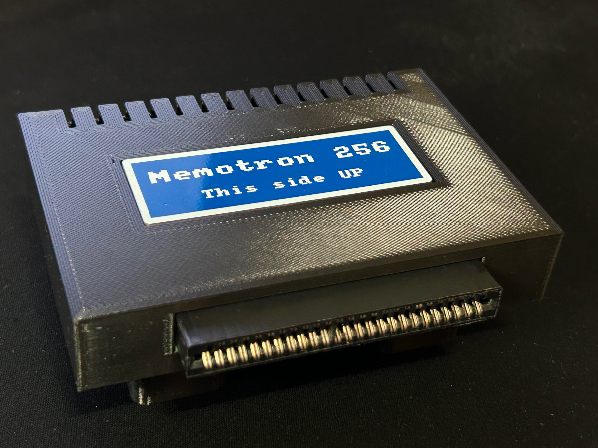

# Memotron 256

__Retro-inspired DIY 256KB memory expansion for the Amstrad CPC 464 computers__

## Introduction

This is a clone of an original 1986 DK'Tronics 64/256KB memory expansion that is plugged into the expansion port of the CPC 464 computer. It is made as period-correct as possible regarding components and mechanical design, and at the same time it is possible to easily manufacture it at home as it uses only through-hole components.

If you have looked for these expansions you will know that they are quite hard to find and relatively expensive, especially for the 256KB variant.

If you like it or if you have any questions, you can drop me a message to my email __inmbolmie [AT] gmail [DOT] com__

## Design

The Memotron 256 has more or less the same board layout as the DK'Tronics 64/256KB memory expansion. I have changed the layout of the edge connectors though to make it easier to manufacture at the expense of taking a little more space on the desk, as the connectors are installed on the plane of the PCB and not perpendicular to it like in the original expansion.

So in the original expansion the PCB is in vertical position when plugged into the computer, while on the Memotron the PCB is placed horizontally. It will take more space but the designed 3D-printed case will provide adequate support for it.

Here you can see the Memotron next to the original DK'Tronics expansion PCB:

The board has an expansion edge connector like the original version where you can plug additional hardware, like disk drives, more expansions, etc.

## Compatibility

The expansion will operate exactly the same as the original. It has been tested on a CPC 464 computer adding to the expansion a Zaxxon DDI-1 disk controller and drive emulator

This is a screenshot of how the extra memory is seen on the Amstrad Diagnostics V1.3A application https://github.com/llopis/amstrad-diagnostics

It has been successfully used with games designed to make use of the 128KB of the CPC 6128, as well as some games and apps that will make use of the full 256KB (like Chibiakumas episode 2 https://www.chibiakumas.com/ep2/), and on CP/M 2.2

The expansion when plugged into a CPC 464 will have its memory mapped to banks 00-03 and you will have a total of 320KB of memory available.

The expansion can be configured with the jumpers also as a 64KB expansion, but this doesn't make much sense as the required memory ICs will cost more or less the same for getting 64KB or 256KB.

The Memotron can be used as a silicon disk connecting the jumper labelled as "Silicon disk enable". What this jumper really does is to change the RAM bank mappings from 00-03 to 04-07 so that you can plug two expansions at the same time for a total of 512KB of extra memory. Like in the original to really use it as a silicon disk you will need external roms not included.

Of course there are a lot of other memory expansions for the CPC made with modern components and going up to 4MB in size, that will be more convenient to use than this one. The point of this project though is being as period-correct as possible (no FPGA rubbish and so ;-) and to be possible to manufacture it at home.

## CPC 6128

Regarding the CPC 6128, the expansion seem to work on BASIC and games (Chibiakumas 2 will work and use the whole 256KB), but doesn't work on CP/M plus, so it is not really 100% compatible with the 6128. DK'Tronics had back in the day a specific version of these expansions for the 6128.

The expansion case feet are removable so contrary to the original one the Memotron will physically fit the 6128 without raising the computer.

When plugged into a CPC 6128, the expansion will have its memory mapped to banks 01-04 and you will have a total of 384KB of memory available.

## Board

There is not much to say about the board as it is the same general layout as the original. I provide all the Kicad designs for the project, as well as a ZIP file containing the gerbers needed to manufacture the board on your favourite online fabricator.

When using the services of a PCB fabricator I recommend manufacturing them with gold fingers and chamfered edge connector. Although that will increase the PCB cost substantially, it will improve the quality of the connection and make it more reliable even than that of the original expansions.

To configure the board as 256KB you will place two jumpers HORIZONTALLY as seen on the picture connecting JP1 to JP2. To configure the board as 64KB you will place only the JP2 jumper VERTICALLY.

### BOM

* One 2x25-pin 2,54mm pitch 90-degree bent edge connector
* 2x74LS157
* 1x74LS74
* 1x74LS153
* 1x74LS174
* 1x74LS27
* 1x74LS11
* 1xPAL16L8 or compatible
* 8xD41256C-15 256Kbit RAM or equivalent
* Pins and jumpers
* 3x680 ohm resistors
* 1x1N4148 diode
* 2xBF241 NPN transistors or equivalent
* 16x100nF ceramic capacitors
* 1x82nF ceramic capacitor (the value is critical and this and/or the value of the R3 resistor may need adjustment)
* Optionally, sockets for all the ICs. The original expansion only had sockets for the eight RAM chips

## 3D-printed enclosure

I provide the STL files for the 3D-printed enclosure that can be printed in four parts (top, bottom, feet and panel). There is a version of the top piece with and without the hole for the name plate.

You will need four M3x12mm and two M3x5mm tapered head screws for assembly.

The case is quite sturdy even printed in PLA and will take typically like 7 hours to print.

### PLD

Regarding the PLD that's on the board, the original expansion uses a vintage PAL16L8 ic that nowadays is pretty deprecated. You can get a vintage unprogrammed piece or use a modern ATF16V8B in its place. It will have to be programmed with a proper PLD programmer from a JED source file. I still don't have my own JED file but you can find one that is compatible with the original memory expansion (tagged as "Datel 64k memory expansion") on this site: https://wiki.pldarchive.co.uk

_"DK'Tronics" and "Datel" are registered trademarks.
All the trademarks are used nominatively to indicate compatibility, and do not indicate affiliation to or endorsement by the trademark owners._
